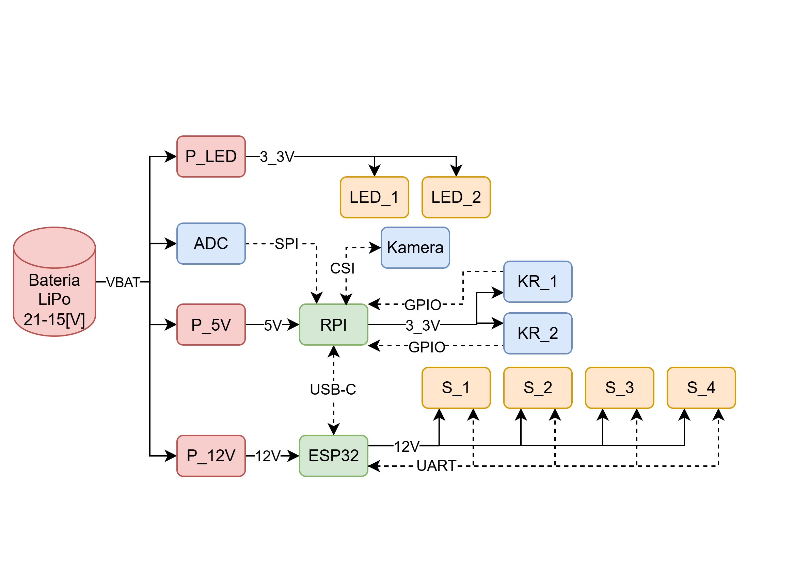

# Autonomiczny robot wspinaczkowy z wbudowanym systemem sterowania
Prototyp robota wspinaczkowego z architekturą **Raspberry Pi 4B + ESP32**, kamerą i czujnikami krańcowymi, z warstwą sterowania serwami cyfrowymi (prędkość/przyspieszenie) oraz testami systemowymi.

Celem pracy było zaprojektowanie i wykonanie autonomicznego robota wspinaczkowego zdolnego do samodzielnego pokonania różnych, dostosowanych pod robota (odległości oraz chwyty), tras wspinaczkowych.

## Efekt końcowy
Poniżej na gifie widać test wspinaczki autonomicznej (zakończoną niepowodzeniem) oraz zsynchronizowany widok interfejsu użytkownika.
	
A tutaj już kilka prób udanych na różnych trasach.
	

## Architektura elektroniczna
Schemat blokowy przedstawiający architekturę elektroniczną:
	

## Projekt 3D
Render złożenia projektu robota wykonanego w Autodesk Inventor:
	.png>)
